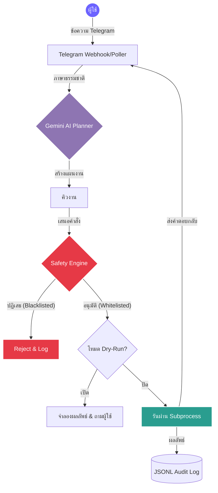

<div align="center">


# 🤖 Telegram AI IT Automation Agent

**บอทช่วยงาน IT automation ผ่าน Telegram พร้อมระบบ safety guardrails, dry-run และ workflow ที่ตรวจสอบย้อนหลังได้**

<i>👉 <a href="README.md">🇬🇧 Read in English</a></i><br><br>

> repo นี้อธิบาย architecture, command safety model และ workflow สำหรับพัฒนาในเครื่อง ควรเพิ่ม demo จริงหลังจากลบข้อมูล hostname, chat และข้อมูลปฏิบัติการที่อ่อนไหวแล้วเท่านั้น

<p>
  <a href="https://github.com/romeototo/telegram-ai-it-automation-agent/releases"></a>
  <a href="https://github.com/romeototo/telegram-ai-it-automation-agent/actions"></a>
  <a href="https://python.org"></a>
  <a href="https://core.telegram.org/bots/api"></a>
  <a href="https://ai.google.dev/"></a>
  <a href="#-safety-engine"></a>
  <a href="LICENSE"></a>
  <a href="https://github.com/romeototo/telegram-ai-it-automation-agent/actions/workflows/test.yml"></a>
  <a href="#-docker-deployment"></a>
</p>

_โปรเจกต์สาธิตการทำงาน (Proof-of-Work) ที่แสดงถึงการปฏิบัติงาน IT ที่ขับเคลื่อนด้วย AI อย่างปลอดภัยผ่านอินเทอร์เฟซการสนทนา_

</div>

---

## Project Snapshot

| รายการ | รายละเอียด |
| ------ | ----------- |
| **บทบาท** | Telegram-based AI agent สำหรับ workflow งาน IT ที่ปลอดภัยขึ้น |
| **Live demo** | Source-first project; ไม่เปิด bot token หรือ production endpoint สาธารณะ |
| **Stack** | Python 3.11, Telegram Bot API, Google Gemini Flash, SQLite + JSONL audit logs, Docker |
| **Impact** | dry-run by default, allowlist/denylist guardrails, auditable command planning |
| **สถานะ** | Active AI automation proof-of-work |
| **Portfolio reference** | [romeototo portfolio](https://romeototo.github.io/portfolio-website/#projects) |

---

## 📖 ภาพรวม

**Telegram AI IT Automation Agent** คือต้นแบบระบบอัตโนมัติขั้นสูงที่ออกแบบมาสำหรับสภาพแวดล้อม IT Support โดยการรวม **Google Gemini AI** เข้ากับ **Telegram API** ระบบนี้จะตีความความต้องการของมนุษย์ที่ซับซ้อน ย่อยออกมาเป็นขั้นตอนที่ทำได้จริง และรันคำสั่งเหล่านั้นอย่างปลอดภัยผ่านโหนดทำงานภายในที่ควบคุมอย่างเข้มงวด

สร้างขึ้นโดยเน้นความปลอดภัยเป็นอันดับแรก โดยมีฟีเจอร์ **Safety Engine**, โหมด **Dry-Run** ที่บังคับใช้ และระบบตรวจสอบ **JSONL Auditing** ที่ครอบคลุม

---

## 🌟 ฟีเจอร์หลัก

- **🧠 AI Planner (Agentic Workflow):** ใช้ LLM ในการทำความเข้าใจคำขอภาษาธรรมชาติ (เช่น _"ตรวจสอบว่าทำไมเซิร์ฟเวอร์ถึงช้า"_) และแปลเป็นชุดคำสั่งการปฏิบัติงานที่ปลอดภัย
- **🛡️ Strict Safety Engine:** ใช้สถาปัตยกรรม `Allowlist` และ `Denylist` ที่เข้มงวด คำสั่งที่อันตราย (เช่น `rm`, `format`, `sudo`) จะถูกสกัดกั้นและบล็อกทันที
- **🚦 Dry-Run โดยพื้นฐาน:** ความปลอดภัยคือสิ่งสำคัญที่สุด คำสั่งจะถูกจำลองผลลัพธ์และส่งกลับไปยังผู้ใช้เพื่อขออนุมัติก่อนที่จะมีการรันในระบบจริง
- **📊 ระบบตรวจสอบย้อนกลับ (Audit Trail):** ทุกคำขอของผู้ใช้, แผนงานที่ AI สร้างขึ้น และการรันคำสั่งจะถูกบันทึกในรูปแบบ `JSONL` เพื่อความโปร่งใสและการตรวจสอบ
- **📱 อินเทอร์เฟซ Telegram แท้ๆ:** ควบคุมและตรวจสอบโครงสร้างพื้นฐาน IT ของคุณได้โดยตรงจากสมาร์ทโฟนผ่านการรวม Telegram ที่ราบรื่น
- **🔐 ระบบยืนยันตัวตนผู้ใช้:** Whitelist ด้วย Telegram User ID เพื่อให้มั่นใจว่าเฉพาะผู้ดูแลที่ได้รับอนุญาตเท่านั้นที่สั่งงานได้
- **📊 รายงานสุขภาพระบบ:** คำสั่ง `/report` รวมข้อมูล CPU, Memory, Disk และ Network ไว้ในรายงานเดียว
- **⏰ การเฝ้าระวังเชิงรุก:** ตรวจสอบสุขภาพระบบอัตโนมัติตามเวลาที่กำหนด และแจ้งเตือนผู้ดูแลเมื่อทรัพยากรถึงจุดวิกฤต
- **💬 อินเทอร์เฟซภาษาธรรมชาติ:** นอกจาก Slash Commands แล้ว ยังพิมพ์คำสั่งเป็นภาษาธรรมชาติได้โดยตรง เช่น "ตรวจพื้นที่ดิสก์"
- **🐳 พร้อมใช้งาน Docker:** ติดตั้งง่ายด้วยคำสั่งเดียว `docker-compose up -d`

---

## 🏗️ สถาปัตยกรรมระบบ

แผนผังต่อไปนี้แสดงวิธีการประมวลผลคำขอของผู้ใช้อย่างปลอดภัย:



---

## 🚀 เริ่มต้นใช้งาน

### 1. สิ่งที่ต้องเตรียม

- Python 3.10 หรือสูงกว่า
- Telegram Bot Token (รับจาก [@BotFather](https://t.me/BotFather))
- Google Gemini API Key

### 2. การติดตั้ง

Clone repository และติดตั้ง dependencies:

```bash
git clone https://github.com/romeototo/telegram-ai-it-automation-agent.git
cd telegram-ai-it-automation-agent
pip install -r requirements.txt
```

### 3. การกำหนดค่า

คัดลอกไฟล์ตัวอย่างและใส่ข้อมูลของคุณ:

```bash
cp .env.example .env
```

แก้ไขไฟล์ `.env`:

```env
TELEGRAM_BOT_TOKEN=your_telegram_token
GEMINI_API_KEY=your_gemini_api_key
ALLOWED_USER_IDS=123456789,987654321
ADMIN_CHAT_ID=123456789
```

### 4. การรันเอเยนต์

**สำหรับผู้ใช้ Windows:**
ดับเบิลคลิกไฟล์ Batch ที่เตรียมไว้ให้:

```cmd
run_bot.bat
```

---

## 💻 คำสั่งที่ใช้ได้

สั่งงานบอทผ่าน Telegram ด้วย Slash Commands ต่อไปนี้:

| คำสั่ง          | คำอธิบาย                                       | ระดับความเสี่ยง |
| --------------- | ---------------------------------------------- | -------------- |
| `/start`        | เริ่มต้นเซสชันบอท                              | 🟢 ต่ำ         |
| `/help`         | แสดงคำสั่งที่ใช้ได้                            | 🟢 ต่ำ         |
| `/status`       | ตรวจสถานะระบบและเอเยนต์                       | 🟢 ต่ำ         |
| `/check_disk`   | ตรวจสอบพื้นที่จัดเก็บข้อมูล                    | 🟢 ต่ำ         |
| `/check_memory` | ตรวจสอบการใช้หน่วยความจำ RAM                   | 🟢 ต่ำ         |
| `/check_cpu`    | ตรวจสอบการใช้ CPU                              | 🟢 ต่ำ         |
| `/check_network`| ตรวจสอบการตั้งค่าเครือข่าย                     | 🟢 ต่ำ         |
| `/report`       | รายงานสุขภาพระบบทั้งหมด (CPU+RAM+Disk+Net)    | 🟢 ต่ำ         |
| `/analyze_log`  | วิเคราะห์ล็อกด้วย AI                          | 🟡 ปานกลาง    |
| `/make_sop`     | สร้าง Standard Operating Procedures            | 🟡 ปานกลาง    |
| `/history`      | ดูประวัติคำสั่งล่าสุด                          | 🟢 ต่ำ         |
| `/dry_run`      | สลับโหมดจำลอง (ค่าเริ่มต้น: เปิด)             | 🔴 ระบบ        |

---

## 🐳 Docker Deployment

วิธีที่เร็วที่สุดในการติดตั้งเอเยนต์:

```bash
# สร้างและรันด้วย Docker Compose
docker-compose up -d

# ดูล็อก
docker-compose logs -f

# หยุด
docker-compose down
```

หรือ Build เอง:

```bash
docker build -t telegram-it-agent .
docker run -d --env-file .env telegram-it-agent
```

---

## 🔒 นโยบายความปลอดภัย

ระบบนี้สร้างขึ้นเพื่อเป็น Proof-of-Work โดยมีโมดูล `src/safety.py` เป็นปราการกั้นระหว่าง AI Planner และระบบปฏิบัติการของคุณ

- **ไม่มีการบันทึกรหัสผ่านในโค้ด:** ข้อมูลสำคัญทั้งหมดต้องจัดการผ่าน `.env`
- **การตรวจสอบคำสั่ง:** บอทไม่สามารถรันคำสั่งแบบเชื่อมโยง (`&&`, `|`, `;`) เพื่อป้องกันการโจมตีแบบ Injection

---

<div align="center">
  <b>สร้างโดย <a href="https://github.com/romeototo">RoMEoTOTO</a></b><br>
  <i>Automate · Control · Innovate</i>
</div>
