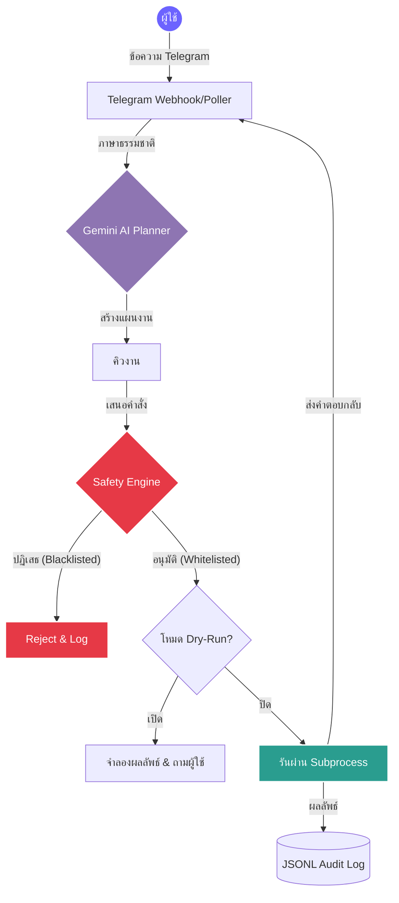

<div align="center">

# 🤖 ตัวแทนอัตโนมัติ IT ผ่าน AI บน Telegram (Telegram AI IT Automation Agent)

**บอทอัตโนมัติ AI ระดับองค์กรพร้อมระบบรักษาความปลอดภัยในตัว**

<i>👉 <a href="README.md">🇬🇧 Read in English</a></i><br><br>

[](https://python.org)
[](https://core.telegram.org/bots/api)
[](https://ai.google.dev/)
[](#-safety-engine)

_โปรเจกต์สาธิตการทำงาน (Proof-of-Work) ที่แสดงถึงการปฏิบัติงาน IT ที่ขับเคลื่อนด้วย AI อย่างปลอดภัยผ่านอินเทอร์เฟซการสนทนา_

</div>

---

## 📖 ภาพรวม

**Telegram AI IT Automation Agent** คือต้นแบบระบบอัตโนมัติขั้นสูงที่ออกแบบมาสำหรับสภาพแวดล้อม IT Support โดยการรวม **Google Gemini AI** เข้ากับ **Telegram API** ระบบนี้จะตีความความต้องการของมนุษย์ที่ซับซ้อน ย่อยออกมาเป็นขั้นตอนที่ทำได้จริง และรันคำสั่งเหล่านั้นอย่างปลอดภัยผ่านโหนดทำงานภายในที่ควบคุมอย่างเข้มงวด

สร้างขึ้นโดยเน้นความปลอดภัยเป็นอันดับแรก โดยมีฟีเจอร์ **Safety Engine**, โหมด **Dry-Run** ที่บังคับใช้ และระบบตรวจสอบ **JSONL Auditing** ที่ครอบคลุม

---

## 🌟 ฟีเจอร์หลัก

- **🧠 AI Planner (Agentic Workflow):** ใช้ LLM ในการทำความเข้าใจคำขอภาษาธรรมชาติ (เช่น _"ตรวจสอบว่าทำไมเซิร์ฟเวอร์ถึงช้า"_) และแปลเป็นชุดคำสั่งการปฏิบัติงานที่ปลอดภัย
- **🛡️ Strict Safety Engine:** ใช้สถาปัตยกรรม `Allowlist` และ `Denylist` ที่เข้มงวด คำสั่งที่อันตราย (เช่น `rm`, `format`, `sudo`) จะถูกสกัดกั้นและบล็อกทันที
- **🚦 Dry-Run โดยพื้นฐาน:** ความปลอดภัยคือสิ่งสำคัญที่สุด คำสั่งจะถูกจำลองผลลัพธ์และส่งกลับไปยังผู้ใช้เพื่อขออนุมัติก่อนที่จะมีการรันในระบบจริง
- **📊 ระบบตรวจสอบย้อนกลับ (Audit Trail):** ทุกคำขอของผู้ใช้, แผนงานที่ AI สร้างขึ้น และการรันคำสั่งจะถูกบันทึกในรูปแบบ `JSONL` เพื่อความโปร่งใสและการตรวจสอบ
- **📱 อินเทอร์เฟซ Telegram แท้ๆ:** ควบคุมและตรวจสอบโครงสร้างพื้นฐาน IT ของคุณได้โดยตรงจากสมาร์ทโฟนผ่านการรวม Telegram ที่ราบรื่น

---

## 🏗️ สถาปัตยกรรมระบบ

แผนผังต่อไปนี้แสดงวิธีการประมวลผลคำขอของผู้ใช้อย่างปลอดภัย:



---

## 🚀 เริ่มต้นใช้งาน

### 1. สิ่งที่ต้องเตรียม

- Python 3.10 หรือสูงกว่า
- Telegram Bot Token (รับจาก [@BotFather](https://t.me/BotFather))
- Google Gemini API Key

### 2. การติดตั้ง

Clone repository และติดตั้ง dependencies:

```bash
git clone https://github.com/romeototo/telegram-ai-it-automation-agent.git
cd telegram-ai-it-automation-agent
pip install -r requirements.txt
```

### 3. การกำหนดค่า

คัดลอกไฟล์ตัวอย่างและใส่ข้อมูลของคุณ:

```bash
cp .env.example .env
```

แก้ไขไฟล์ `.env`:

```env
TELEGRAM_BOT_TOKEN=your_telegram_token
GEMINI_API_KEY=your_gemini_api_key
```

### 4. การรันเอเยนต์

**สำหรับผู้ใช้ Windows:**
ดับเบิลคลิกไฟล์ Batch ที่เตรียมไว้ให้:

```cmd
run_bot.bat
```

---

## 🔒 นโยบายความปลอดภัย

ระบบนี้สร้างขึ้นเพื่อเป็น Proof-of-Work โดยมีโมดูล `src/safety.py` เป็นปราการกั้นระหว่าง AI Planner และระบบปฏิบัติการของคุณ

- **ไม่มีการบันทึกรหัสผ่านในโค้ด:** ข้อมูลสำคัญทั้งหมดต้องจัดการผ่าน `.env`
- **การตรวจสอบคำสั่ง:** บอทไม่สามารถรันคำสั่งแบบเชื่อมโยง (`&&`, `|`, `;`) เพื่อป้องกันการโจมตีแบบ Injection

---

<div align="center">
  <b>สร้างโดย <a href="https://github.com/romeototo">RoMEoTOTO</a></b><br>
  <i>Automate · Control · Innovate</i>
</div>
