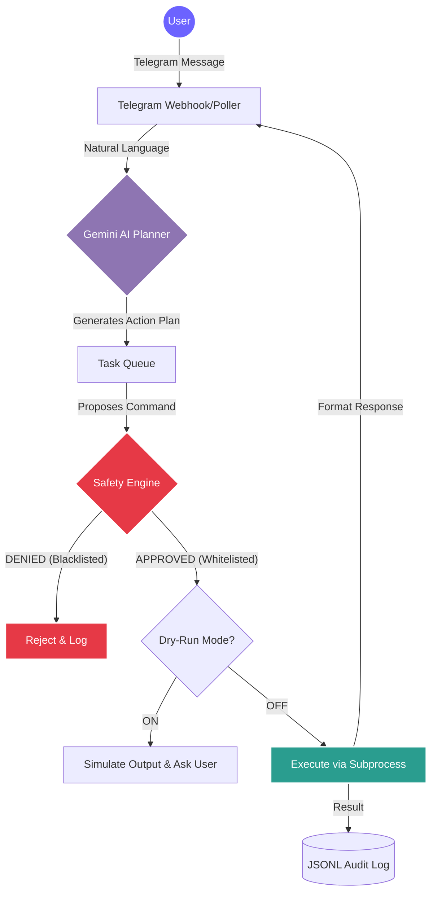

<div align="center">

# 🤖 Telegram AI IT Automation Agent

**Enterprise-Grade AI Automation Bot with Built-in Safety Guardrails**

[](https://python.org)
[](https://core.telegram.org/bots/api)
[](https://ai.google.dev/)
[](#-safety-engine)

*A Proof-of-Work project demonstrating secure, AI-driven IT operations via conversational interfaces.*

</div>

---

## 📖 Overview

The **Telegram AI IT Automation Agent** is an advanced workflow automation prototype designed for IT Support environments. By integrating **Google Gemini AI** with the **Telegram API**, this system interprets complex human intents, breaks them down into actionable steps, and executes them safely using a highly controlled local worker node.

Built with security as the primary focus, it features a robust **Safety Engine**, mandatory **Dry-Run modes**, and comprehensive **JSONL Auditing**.

---

## 🌟 Key Features

- **🧠 AI Planner (Agentic Workflow):** Leverages LLMs to understand natural language requests (e.g., *"Check why the server is slow"*) and translates them into a sequence of safe operational commands.
- **🛡️ Strict Safety Engine:** Employs rigorous `Allowlist` and `Denylist` architectures. Destructive commands (like `rm`, `format`, `sudo`) are actively intercepted and blocked.
- **🚦 Dry-Run by Default:** Safety is paramount. Commands are simulated and returned to the user for approval before any actual system execution occurs.
- **📊 Complete Audit Trail:** Every user request, AI-generated plan, and command execution is securely logged in `JSONL` format for compliance and monitoring.
- **📱 Native Telegram Interface:** Control and monitor your IT infrastructure directly from your smartphone with seamless Telegram integration.

---

## 🏗️ System Architecture

The following diagram illustrates how user requests are securely processed:



---

## 🚀 Getting Started

### 1. Prerequisites
- Python 3.10 or higher
- A Telegram Bot Token (from [@BotFather](https://t.me/BotFather))
- Google Gemini API Key

### 2. Installation

Clone the repository and install dependencies:
```bash
git clone https://github.com/romeototo/telegram-ai-it-automation-agent.git
cd telegram-ai-it-automation-agent
pip install -r requirements.txt
```

### 3. Configuration

Duplicate the example environment file and configure your credentials:
```bash
cp .env.example .env
```
Edit `.env` to include your specific tokens:
```env
TELEGRAM_BOT_TOKEN=your_telegram_token
GEMINI_API_KEY=your_gemini_api_key
```

### 4. Running the Agent

**For Windows Users:**
Simply double-click the included batch file:
```cmd
run_bot.bat
```

**For Linux/macOS:**
```bash
python src/main.py
```

---

## 💻 Available Commands

Interact with the bot on Telegram using the following slash commands:

| Command | Description | Risk Level |
|---------|-------------|------------|
| `/start` | Initialize the bot session | 🟢 Low |
| `/status` | Check system and agent status | 🟢 Low |
| `/check_disk` | Safely query storage metrics | 🟢 Low |
| `/check_memory` | Safely query RAM utilization | 🟢 Low |
| `/analyze_log` | Use AI to summarize error logs | 🟡 Medium |
| `/dry_run` | Toggle safe simulation mode (Default: ON) | 🔴 System |

---

## 🔒 Security Policy

This system is built as a Proof-of-Work. The `src/safety.py` module acts as an immutable barrier between the AI Planner and your host OS. 
- **No Hardcoded Secrets:** All tokens must be managed via `.env`.
- **Command Sanitization:** The bot cannot execute chained commands (`&&`, `|`, `;`) to prevent injection attacks.

*For detailed security implementations, please refer to the `docs/` folder.*

---

<div align="center">
  <b>Built by <a href="https://github.com/romeototo">RoMEoTOTO</a></b><br>
  <i>Automate · Control · Innovate</i>
</div>
