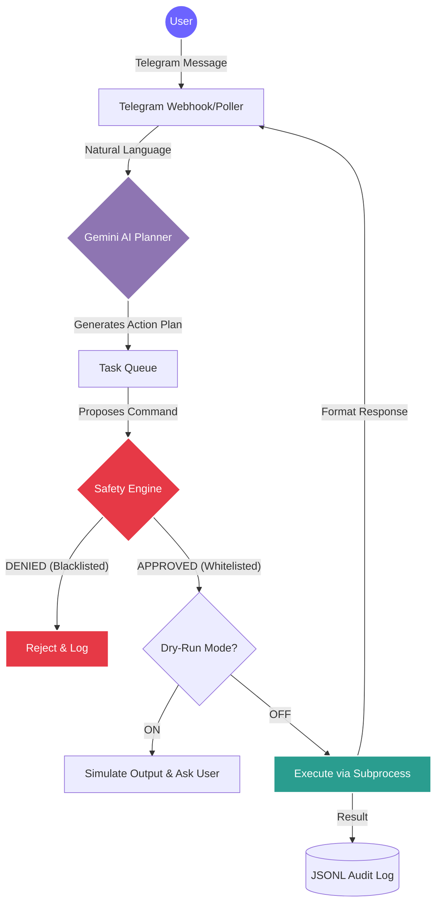

<div align="center">

# 🤖 Telegram AI IT Automation Agent

**Enterprise-Grade AI Automation Bot with Built-in Safety Guardrails**

<i>👉 <a href="README-th.md">🇹🇭 อ่านรายละเอียดภาษาไทย</a></i><br><br>

<p>
  <a href="https://github.com/romeototo/telegram-ai-it-automation-agent/releases"></a>
  <a href="https://github.com/romeototo/telegram-ai-it-automation-agent/actions"></a>
  <a href="https://python.org"></a>
  <a href="https://core.telegram.org/bots/api"></a>
  <a href="https://ai.google.dev/"></a>
  <a href="#-safety-engine"></a>
  <a href="LICENSE"></a>
  <a href="https://github.com/romeototo/telegram-ai-it-automation-agent/actions/workflows/test.yml"></a>
  <a href="#-docker-deployment"></a>
</p>

_A Proof-of-Work project demonstrating secure, AI-driven IT operations via conversational interfaces._

</div>

---

## Project Snapshot

| Item | Details |
| ---- | ------- |
| **Role** | Telegram-based AI agent for safer IT operations workflows |
| **Live demo** | Source-first project; no public bot token or production endpoint is exposed |
| **Stack** | Python 3.11, Telegram Bot API, Google Gemini Flash, SQLite + JSONL audit logs, Docker |
| **Impact** | Dry-run by default, allowlist/denylist guardrails, auditable command planning |
| **Status** | Active AI automation proof-of-work |
| **Portfolio reference** | [romeototo portfolio](https://romeototo.github.io/portfolio-website/#projects) |

---

## 📖 Overview

The **Telegram AI IT Automation Agent** is an advanced workflow automation prototype designed for IT Support environments. By integrating **Google Gemini AI** with the **Telegram API**, this system interprets complex human intents, breaks them down into actionable steps, and executes them safely using a highly controlled local worker node.

Built with security as the primary focus, it features a robust **Safety Engine**, mandatory **Dry-Run modes**, and comprehensive **JSONL Auditing**.

---

## 🌟 Key Features

- **🧠 AI Planner (Agentic Workflow):** Leverages LLMs to understand natural language requests (e.g., _"Check why the server is slow"_) and translates them into a sequence of safe operational commands.
- **🛡️ Strict Safety Engine:** Employs rigorous `Allowlist` and `Denylist` architectures. Destructive commands (like `rm`, `format`, `sudo`) are actively intercepted and blocked.
- **🚦 Dry-Run by Default:** Safety is paramount. Commands are simulated and returned to the user for approval before any actual system execution occurs.
- **📊 Complete Audit Trail:** Every user request, AI-generated plan, and command execution is securely logged in `JSONL` format for compliance and monitoring.
- **📱 Native Telegram Interface:** Control and monitor your IT infrastructure directly from your smartphone with seamless Telegram integration.
- **🔐 User Authorization:** Telegram user ID whitelist ensures only authorized operators can issue commands.
- **📊 System Health Reports:** Consolidated `/report` command provides CPU, Memory, Disk, and Network status in one view.
- **⏰ Proactive Monitoring:** Scheduled health checks automatically alert admins when system resources reach critical thresholds.
- **💬 Natural Language Interface:** Beyond slash commands, operators can type natural language requests like "check disk space" directly.
- **🐳 Docker Ready:** One-command deployment with `docker-compose up -d` for instant setup.

---

## 🏗️ System Architecture

The following diagram illustrates how user requests are securely processed:


```mermaid
graph TD
    %% Define Styles
    classDef user fill:#6C63FF,stroke:#fff,stroke-width:2px,color:#fff;
    classDef ai fill:#8E75B2,stroke:#fff,stroke-width:2px,color:#fff;
    classDef security fill:#E63946,stroke:#fff,stroke-width:2px,color:#fff;
    classDef system fill:#2A9D8F,stroke:#fff,stroke-width:2px,color:#fff;

    A((User)):::user -- "Telegram Message" --> B[Telegram Webhook/Poller]
    B -- "Natural Language" --> C{Gemini AI Planner}:::ai
    C -- "Generates Action Plan" --> D[Task Queue]
    D -- "Proposes Command" --> E{Safety Engine}:::security

    E -- "DENIED (Blacklisted)" --> F[Reject & Log]:::security
    E -- "APPROVED (Whitelisted)" --> G{Dry-Run Mode?}

    G -- "ON" --> H[Simulate Output & Ask User]
    G -- "OFF" --> I[Execute via Subprocess]:::system

    I -- "Result" --> J[(JSONL Audit Log)]
    I -- "Format Response" --> B
```

---

## 🚀 Getting Started

### 1. Prerequisites

- Python 3.10 or higher
- A Telegram Bot Token (from [@BotFather](https://t.me/BotFather))
- Google Gemini API Key

### 2. Installation

Clone the repository and install dependencies:

```bash
git clone https://github.com/romeototo/telegram-ai-it-automation-agent.git
cd telegram-ai-it-automation-agent
pip install -r requirements.txt
```

### 3. Configuration

Duplicate the example environment file and configure your credentials:

```bash
cp .env.example .env
```

Edit `.env` to include your specific tokens:

```env
TELEGRAM_BOT_TOKEN=your_telegram_token
GEMINI_API_KEY=your_gemini_api_key
ALLOWED_USER_IDS=123456789,987654321
ADMIN_CHAT_ID=123456789
```

### 4. Running the Agent

**For Windows Users:**
Simply double-click the included batch file:

```cmd
run_bot.bat
```

**For Linux/macOS:**

```bash
python src/main.py
```

---

## 💻 Available Commands

Interact with the bot on Telegram using the following slash commands:

| Command         | Description                                    | Risk Level |
| --------------- | ---------------------------------------------- | ---------- |
| `/start`        | Initialize the bot session                     | 🟢 Low     |
| `/help`         | Show available commands                        | 🟢 Low     |
| `/status`       | Check system and agent status                  | 🟢 Low     |
| `/check_disk`   | Safely query storage metrics                   | 🟢 Low     |
| `/check_memory` | Safely query RAM utilization                   | 🟢 Low     |
| `/check_cpu`    | Check CPU utilization                          | 🟢 Low     |
| `/check_network`| Check network configuration                    | 🟢 Low     |
| `/report`       | Full system health report (CPU+RAM+Disk+Net)   | 🟢 Low     |
| `/analyze_log`  | AI-powered log analysis and summarization      | 🟡 Medium  |
| `/make_sop`     | Generate Standard Operating Procedures         | 🟡 Medium  |
| `/history`      | View recent command execution history          | 🟢 Low     |
| `/dry_run`      | Toggle safe simulation mode (Default: ON)      | 🔴 System  |

---

## 🐳 Docker Deployment

The fastest way to deploy the agent:

```bash
# Build and run with Docker Compose
docker-compose up -d

# View logs
docker-compose logs -f

# Stop
docker-compose down
```

Or build manually:

```bash
docker build -t telegram-it-agent .
docker run -d --env-file .env telegram-it-agent
```

---

## 🔒 Security Policy

This system is built as a Proof-of-Work. The `src/safety.py` module acts as an immutable barrier between the AI Planner and your host OS.

- **No Hardcoded Secrets:** All tokens must be managed via `.env`.
- **Command Sanitization:** The bot cannot execute chained commands (`&&`, `|`, `;`) to prevent injection attacks.

_For detailed security implementations, please refer to the `docs/` folder._

---

<div align="center">
  <b>Built by <a href="https://github.com/romeototo">RoMEoTOTO</a></b><br>
  <i>Automate · Control · Innovate</i>
</div>
