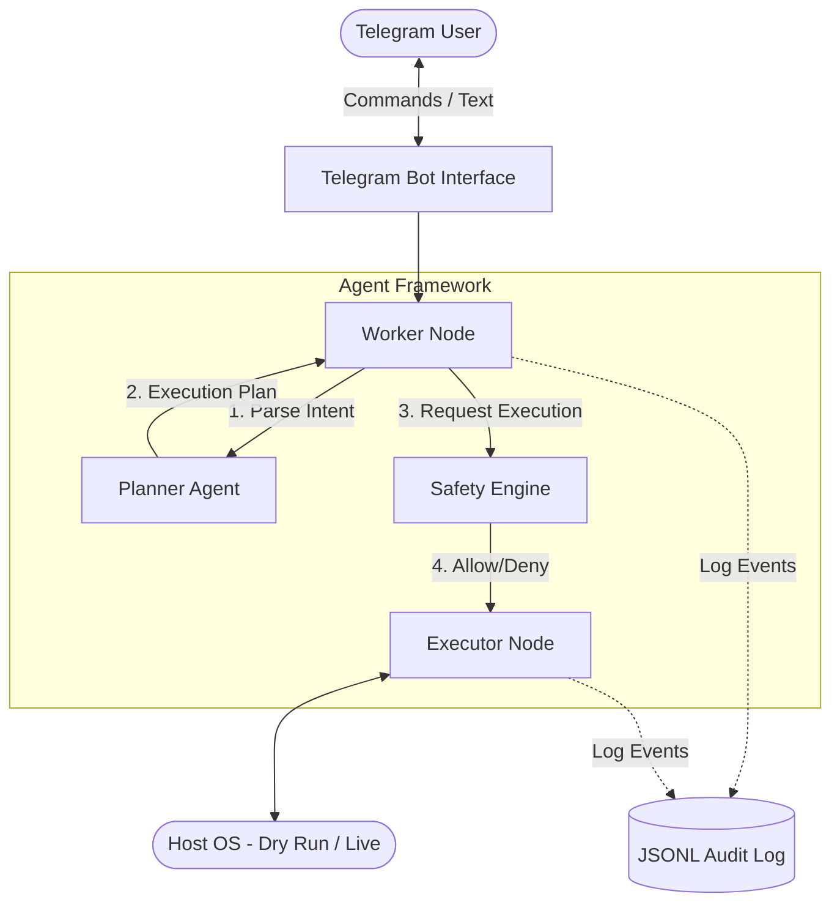

# System Architecture

## Components
- **Bot**: The asynchronous event loop provided by `python-telegram-bot`.
- **Worker**: The orchestrator holding the state of the current request.
- **Planner**: AI logic (Mocked in prototype) translating natural language to terminal commands.
- **Safety Engine**: Hard-coded allowlist/denylist ensuring no rogue commands run.
- **Executor**: Wraps `subprocess` for system interaction.
